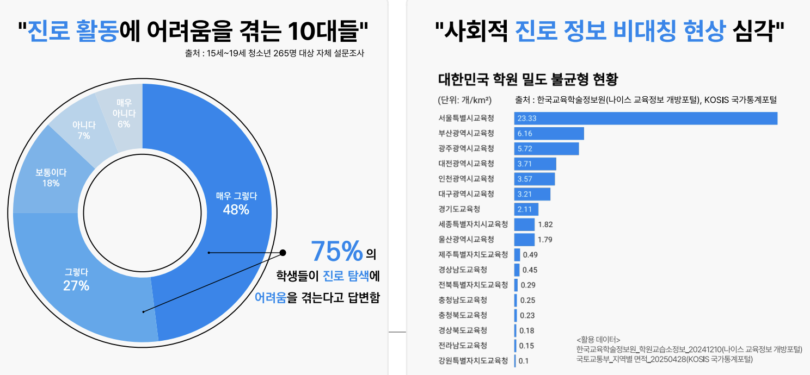
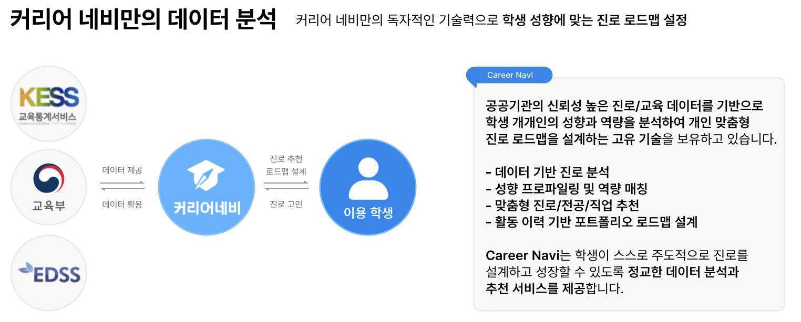
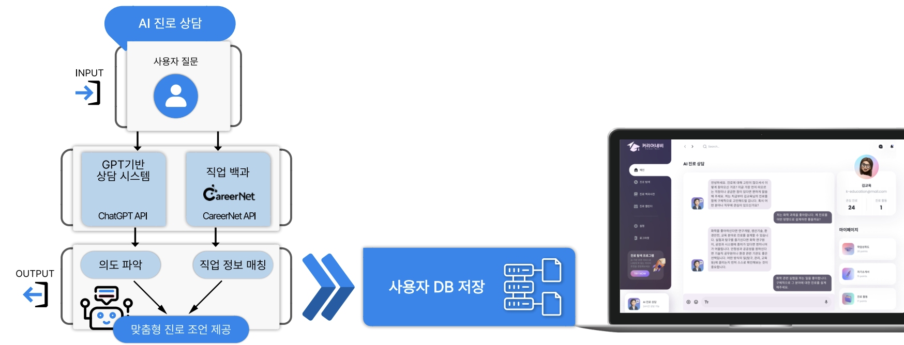
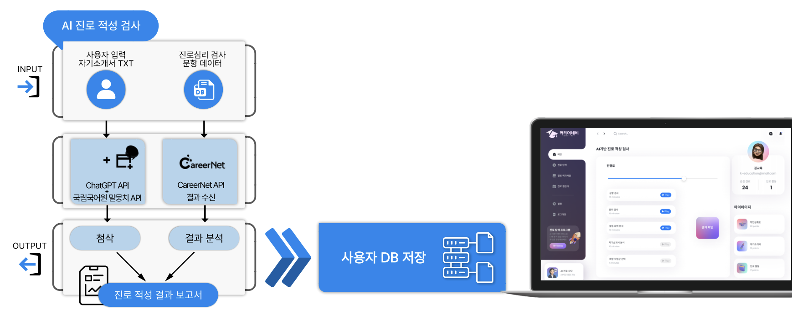
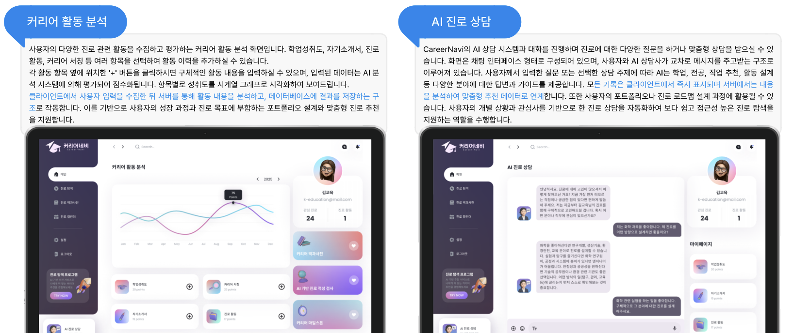
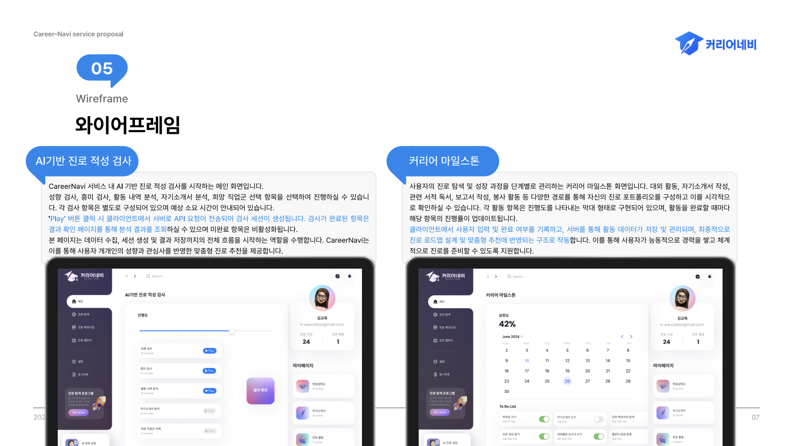
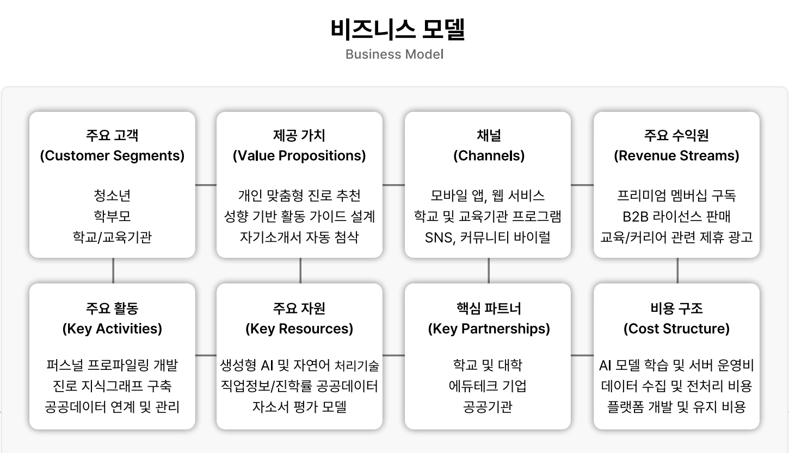
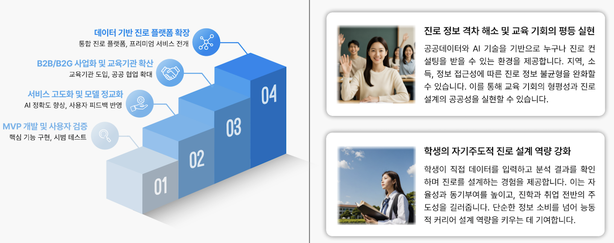

<div align="center">

### 🚀 지금 바로 나만의 진로 로드맵을 만들어보세요! (PC 전용 버전) 

# 👉 [www.careernavi.kr](https://www.careernavi.kr)

</div>

# 🧭 CareerNavi: AI 기반 진로 설계 및 추천 서비스


> 공공 교육데이터와 AI 기술을 융합하여  
> 청소년의 진로 정보 접근 격차를 해소하고  
> 성향 기반의 맞춤형 진로 로드맵을 설계하는 차세대 진로 탐색 플랫폼


---


## 👨‍💻 TEAM 잡스케치 (JobSketch)

잡스케치(JobSketch)는  
진로를 설계하고 싶은 학생들을 위해,  
AI와 공공데이터를 활용한 진짜 ‘진로 설계 도구’를 만들기 위해 시작된 팀입니다.

‘Job을 스케치한다’, 동시에 ‘잡(Job)을 캐치(Catch)한다’는  
**이중적인 의미를 담은 이름**처럼,  
우리는 학생들이 자신의 미래를 직접 그리고, 정확히 잡을 수 있도록 돕고자 합니다.

### 시작은 아주 사적이고도 명확한 문제의식에서 출발했습니다.

3년 넘게 대구에서 고등학생들을 직접 지도하며,  
**진로에 대한 정보 격차, 그리고 상담 기회의 불균형**을 끊임없이 마주했습니다.  
학생부종합전형을 준비하는 과정에서도,  
서울과 지방, 교육 환경의 차이가 결과를 얼마나 좌우하는지를 몸소 겪었죠.

단순한 정보 제공이 아닌,  
**학생의 경험과 성향을 기반으로 '설계할 수 있는 진로'를 제시할 수 있다면**  
이 문제를 기술로 풀 수 있다고 생각했습니다.

그래서 우리는,  
**진단부터 상담, 그리고 로드맵 설계까지 이어지는  
데이터 기반 진로 탐색 플랫폼, CareerNavi**를 만들었습니다.

---

### 👥 팀원 소개

| 이름 | 전공 | 역할 | 간단 소개 |
|------|------|------|-----------|
| **황지영** | 컴퓨터공학 (DGIST) | 총괄 / 백엔드 / AI 분석 | GPT 기반 진단 알고리즘 설계 및 시스템 백엔드 전반을 담당. 진로 알고리즘 설계와 서비스 구조를 주도적으로 이끌고 있음. |
| **마서진** | 컴퓨터공학 (DGIST) | 프론트엔드 / 데이터 시각화 | 공공데이터 수집 및 전처리, 웹 기반 시각화, UI 개발 담당. Folium·Streamlit 등 시각화 도구 활용에 능숙. |

---

**잡스케치는 단순한 개발팀이 아닙니다.**

우리는 문제를 **'기술'로만 풀지 않습니다.**  
현장에서 체감한 불균형을,  
데이터와 알고리즘, 그리고 서비스 설계로 해결하고자 하는  
**실전형 빌더 팀**입니다.

이제 CareerNavi는 단순 서비스 기획을 넘어,  
실제 학교와 교육청에서 사용될 수 있는  
**실질적인 진로 탐색 도구**로 진화하는 중입니다.

> CareerNavi는 현재 고등학생을 중심으로 진로 탐색 문제를 해결하고 있지만,  
> **진로를 고민하고 설계하는 건 대학생도 마찬가지**라는 걸 알고 있습니다.  
> 단지 ‘어떤 학과를 가야 할까’에서  
> ‘어떤 커리어를 설계해야 할까’로 질문이 바뀔 뿐입니다.  
>
> 잡스케치는 앞으로 CareerNavi를 **대학생까지 확장 가능한 커리어 설계 플랫폼으로 발전**시켜,  
> **학과 선택 → 경험 분석 → 커리어 추천**으로 이어지는  
> **인생 전반의 ‘진로 탐색 여정’을 함께할 수 있도록 만들고자 합니다.


---

## 📌 프로젝트 개요

커리어네비는 교육 공공데이터와 AI 기술을 융합해  
학생의 성향, 활동 이력, 자기소개서 등을 분석하고,  
진단 → 상담 → 로드맵 설계를 자동화한 **AI 기반 진로 설계 플랫폼**입니다.

- **GPT 기반 상담**, **공공 진로 데이터 통합**, **성취도 기반 로드맵 설계**
- 사교육 없이 누구나 자신의 진로를 탐색하고 설계할 수 있는 기회 제공
- 교육 정보 격차 해소 및 자기주도 역량 강화

---

## 🧐 **Problem: 청소년의 진로 정보 접근 격차**




### 🚧 **진로 활동에 어려움을 겪는 10대들**

* 대한민국의 청소년 중 \*\*75%\*\*가 **진로 탐색에 어려움을 겪는다**고 응답했습니다.
* 학습 방향 설정, 목표 설정, 목표 달성 방법에 대한 정보 부족으로 인해 혼란을 겪습니다.
* 특히 **농어촌, 비수도권, 저소득층 가정**일수록 교육 인프라의 격차로 인해 공공 진로 정보에 대한 접근성이 극도로 낮습니다.

> "정보가 없으면 선택이 없다."
> — 지역 간 교육 격차는 곧 미래 격차로 이어집니다.


### 🏞️ **사회적 진로 정보 비대칭 현상**

* 상단 우측의 그래프는 **지역별 학원 밀도 불균형**을 보여줍니다.
* 서울특별시는 23.33개/km²로 압도적인 진로 학습 인프라를 가지고 있지만,
  강원도는 0.18개/km²로 그 격차가 100배 이상 벌어져 있습니다.
* 이러한 격차는 교육 자원의 집중화와 정보 접근의 어려움을 가중시키며,
  학생들이 **진로를 설계할 기회조차 가지지 못하는 현실**을 만들어냅니다.

> "단순한 진로 탐색이 아니라, **공정한 진로 접근권**을 보장하는 플랫폼이 필요합니다."


### 🔎 **CareerNavi의 역할**

* CareerNavi는 이러한 정보의 불균형을 해소하기 위해 개발되었습니다.
* 지역, 계층, 학습 환경에 구애받지 않고 **누구나 진로를 설계할 수 있는 기회**를 제공합니다.
* 이를 통해 **정보 격차를 해소**하고, **자기주도적 학습 환경**을 구축합니다.


---

### 💡 **솔루션: CareerNavi**

---


### 🔍 **CareerNavi가 제안하는 솔루션**

CareerNavi는 학생 개개인의 **진로 역량**을 AI 기반으로 분석하고,
**맞춤형 학습 로드맵**과 **포트폴리오**를 자동 생성합니다.

* **교육 공공데이터 활용** → 신뢰도 높은 정보로 학습 설계
* **AI 기반 진로 진단** → GPT와 NLP를 결합하여 정량적 분석
* **마일스톤 설정** → 목표 달성을 위한 단계별 학습 설계
* **포트폴리오 생성** → 실시간 성과 시각화 및 자동 리포트
* **AI 진로 상담** → 챗봇을 통해 실시간 진로 고민 해결 및 방향성 제시

> "학생들은 더 이상 방황하지 않고, CareerNavi의 로드맵을 따라 꿈을 향해 나아갈 수 있습니다."


### ✨ **CareerNavi의 핵심 기능**

1️⃣ **진로 탐색 프로그램**

* AI 기반 맞춤형 진로 적성 검사
* 사용자 활동 이력과 자기소개서 분석을 통한 진로 설계

2️⃣ **커리어 백과사전**

* 공공데이터를 통해 실시간으로 업데이트되는 직업 및 학과 정보
* 관심 직업과 연계된 최신 트렌드 및 직무 기술 소개

3️⃣ **AI 진로 상담 (AI Career Counseling)**

* ChatGPT 기반의 AI 챗봇이 실시간 진로 상담 제공
* 학생의 성향과 목표를 분석하여 최적의 학습 방향을 제시
* 진로 고민, 학과 선택, 커리어 플래닝 등 폭넓은 상담 지원

> "진로에 대한 막연한 불안감을, 실시간 AI 상담으로 해결합니다."

4️⃣ **마일스톤 설계**

* 활동 분석에 따른 학습 목표 설정
* 단계별 목표 달성 및 성취도 평가

5️⃣ **포트폴리오 생성**

* 활동 내역과 성과를 정리하여 자동 포트폴리오 생성
* 학습 진도에 따른 시각적 리포트 출력


### 🎯 **왜 CareerNavi인가?**

* **데이터 기반 진로 분석**: 공공데이터와 AI를 통해 신뢰할 수 있는 진로 추천
* **누구나 접근 가능한 서비스**: 지역, 계층 상관없이 동일한 학습 기회 제공
* **시각적 학습 관리**: 직관적인 대시보드와 시각화된 포트폴리오
* **실시간 AI 진로 상담**: 전문가의 도움 없이도 즉시 답변을 받을 수 있는 챗봇 기능

> CareerNavi는 학생들의 꿈을 구체적인 목표와 계획으로 바꿔줍니다.
> 이젠 혼자 방황하지 않고, 명확한 길을 따라 나아갈 시간입니다.


---

## 🎯 커리어네비의 핵심 포인트

CareerNavi는 단순히 진로를 탐색하는 것을 넘어서,
**퍼스널 프로파일링 기술**을 통해 **학생의 성향에 맞춘 맞춤형 진로 로드맵**을 제안합니다.





### 🔎 **핵심 기능 설명**

| 포인트 | 설명 |
|--------|------|
| 🔎 진단 → 상담 → 설계 | 활동 기반 진로 진단 → AI 상담 → 마일스톤 기반 로드맵 설계 |
| 🧠 AI 기반 역량 분석 | GPT + NLP 임베딩으로 텍스트 기반 역량 점수화 |
| 🗂️ 데이터 연계 | 진로/전공/직업/심리검사 공공데이터 통합 분석 |
| 📊 시각화 & 포트폴리오 | 결과를 시각화하고 포트폴리오/자기소개서 작성에 연동 |
| 🗺️ 지역 불균형 해소 | 학원 및 교육자원 데이터 기반 지역 편차 시각화 제공 |


### 📌 **CareerNavi만의 데이터 분석 기술**

* CareerNavi는 **KESS(교육통계서비스)**, **교육부**, \*\*EDSS(교육통계지원시스템)\*\*와의 데이터 연계를 통해,
  **신뢰성 높은 진로 정보**를 제공합니다.
* 학생의 활동 이력, 자기소개서, 검사 결과를 바탕으로 **진로 적합성 분석**을 수행합니다.


---

## 🧠 활용 공공데이터 (출처 및 URL 포함)

| 제공기관 | 데이터명 | 활용 목적 | 링크 |
|----------|----------|-----------|------|
| 한국직업능력연구원 | 커리어넷 대학학과정보 | 적합 전공 추천 | [🔗](http://www.career.go.kr/cnet/front/openapi/openApiMajorCenter.do) |
| 〃 | 진로심리검사 | 성향 기반 진단 | [🔗](http://www.career.go.kr/cnet/front/openapi/openApiTestCenter.do) |
| 〃 | 커리어넷 직업정보 | 관심 직업 매칭 | [🔗](http://www.career.go.kr/cnet/front/openapi/openApiJobCenter.do) |
| 국립국어원 | 모두의 말뭉치 API | 텍스트 의미 분석 | [🔗](https://kli.korean.go.kr/corpus/openapi/openapiguide.do) |
| 한국고용정보원 | 워크넷 학과정보 | 학과–직업 연계 | [🔗](https://www.work24.go.kr/cm/e/a/0110/selectOpenApiSvcInfo.do) |
| 한국대학교육협의회 | 대학알리미 | 대학 정보 시각화 | [🔗](https://www.data.go.kr/data/15037507/openapi.do) |
| 한국교육개발원 | 대학 개황 | 지역 교육 격차 분석 | [🔗](https://www.data.go.kr/data/15053812/fileData.do) |
| 한국교육학술정보원 | 전국학원·교습소 데이터 | 지역별 진로 인프라 시각화 | [🔗](https://open.neis.go.kr/portal/data/service/selectServicePage.do?infId=OPEN19220231012134453534385) |

---

## 🧠 참고 논문 및 선행연구

| 논문명 | 요약 | 링크 |
|--------|------|------|
| Artificial Intelligence for Career Guidance | 진로 지도에 AI를 접목한 초기 모델 분석 | [🔗 PDF](https://files.eric.ed.gov/fulltext/EJ1318705.pdf) |
| AI-Driven Career Guidance System | 성적·희망 기반 전공 추천 예측 모델 | [🔗 논문](https://www.researchgate.net/publication/388026845_AI-Driven_Career_Guidance_System) |
| Artificial Intelligence in Career Counseling: ResumAI | 이력서 기반 진로 추천 서비스 사례 분석 | [🔗 논문](https://www.researchgate.net/publication/373451445_Artificial_Intelligence_in_Career_Counseling) |
| Customized AI Career Recommender (Rural Univ.) | 지역 소외계층 대상 맞춤형 진로 추천 시스템 | [🔗 논문](https://digitalcommons.kennesaw.edu/acist/2023/presentations/1/) |
| AI-Based Career Guidance System for Students | 학생 중심의 자동화된 진로 설계 시스템 제안 | [🔗 논문](https://www.jetir.org/view?paper=JETIR2504174) |
| CAREERWISE: AI Based Career Advisor | AI 진로 추천 챗봇 플랫폼 구현 사례 | [🔗 논문](https://www.ijprems.com/uploadedfiles/paper//issue_11_november_2024/37123/final/fin_ijprems1733111259.pdf) |
| Exploring the Role of AI in Career Access | AI 진로 접근성의 사회 정의적 역할 | [🔗 논문](https://njtcg.org/articles/10.16993/njtcg.77) |

---

## 🧱 시스템 구성 및 작동 원리

- **INPUT**: 자기소개서, 활동이력, 진로검사 결과
- **분석**: GPT 임베딩 + 공공데이터 매핑
- **저장**: 사용자별 진단 결과 DB 기록
- **출력**: 진단 점수, 추천 직업/전공, 시각화 리포트






```txt
사용자 입력
 → NLP + GPT 분석
 → CareerNet + 진로검사 데이터 통합
 → 성취도 점수 및 마일스톤 생성
 → 대시보드 시각화 및 리포트 출력
```

---

## 📊 플로우 차트 / 와이어프레임




- 활동 분석 → 성취도 점수화  
- 진로 성향 검사 결과 + GPT 분석  
- 마일스톤 자동 추천  
- 포트폴리오 생성


---

## 💼 비즈니스 모델



| 항목 | 내용 |
|------|------|
| 대상 | 청소년, 학교, 교육청, 진로상담기관 |
| 수익모델 | B2B 기관 리포트 판매, 프리미엄 포트폴리오 생성 기능 |
| 경쟁력 | 공공데이터 활용 + AI 기반 진단 → 데이터 기반 신뢰도 |
| 확장성 | 교육청 진로교육 플랫폼 연동, 해외 공공교육 적용 가능성 |

---

## 🛠️ 기술 스택

- **Frontend**: React, Tailwind, Zustand, Vite
- **Backend**: Spring Boot, REST API, Gradle, MySQL
- **AI**: OpenAI GPT-3.5, HuggingFace Transformers, SentenceEmbedding
- **Visualization**: Streamlit, Folium, Matplotlib
- **Data**: Pandas, JSON, CareerNet API

---

## 📈 로드맵 및 기대효과


### 1️⃣ 개발 단계

- [x] MVP 개발 및 테스트 완료 (배포 링크: https://careerall.netlify.app)
- [x] 실제 웹서비스 구현 (사이트 링크: https://www.careernavi.kr)
- [ ] 사용자 피드백 수집 및 개선
- [ ] 지자체 및 교육청 대상 B2G 서비스 제안 예정

### 2️⃣ 기대효과

- 진로 정보 비대칭 해소 및 지역 격차 완화
- 공공데이터 기반 진로 서비스의 선도 모델 제시
- 청소년의 **자기주도적 진로 설계 역량 강화**


---
## 📜 라이선스

이 프로젝트는 공공데이터 기반 비영리 교육 솔루션입니다.  
MIT License © 2025 TEAM 잡스케치
```
